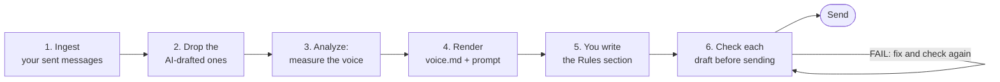
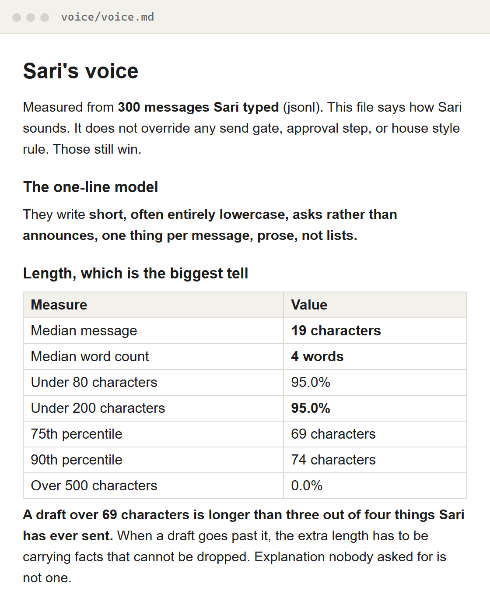

# voiceprint

**AI messages that still sound like you.**

voiceprint reads the messages you already sent and measures how you write: how long, how you open, the words that end your sentences, and the habits you never have. Then it holds every AI draft against that profile before it goes out. It does not rewrite the draft. It names the parts that are not you, and says why.

[](LICENSE)
[](CHANGELOG.md)
[](#requirements)


## AI writes your first draft now

Slack replies, work chats, a short update to your boss. Claude or ChatGPT writes them in seconds, and you just press send. voiceprint gives that drafting step two things: a measured model of your voice, and a check that runs before the send.

| Command | What it does | Example |
| :--- | :--- | :--- |
| `ingest` | Pulls your own sent messages into a corpus, and drops the ones an AI drafted for you | `voiceprint.py ingest --source whatsapp --path ./chats --me-name "Sam" --exclude-scan ./drafts` |
| `analyze` | Measures the corpus: length, seventeen habits, sentence endings, openers, phrases | `voiceprint.py analyze corpus.json --out profile.json` |
| `render` | Writes `voice.md` for a person or an agent, and `voice_prompt.txt` to paste into a prompt | `voiceprint.py render profile.json --out-dir ./voice --name "Sam"` |
| `check` | Holds one draft against the profile. Exit 1 with a list of failures, exit 0 on a pass | `voiceprint.py check --profile profile.json --file draft.md` |

## But AI writing has a smell, and people spot it

"Write like me" is a description you give from memory. Nobody remembers how they actually write. So the draft comes back like this:

- It opens with "I hope this finds you well". You never write that to a teammate.
- A one-line answer turns into three paragraphs, with bullets and bold.
- "Kindly" and "Best regards" go out to someone you message ten times a day.
- A teammate replies: "Is this ChatGPT?"
- You fix it by hand, and the fix takes longer than writing it yourself.

The more you let AI draft for you, the less your messages sound like you.

## The fix: measure the voice, then check every draft

voiceprint learns from messages you really sent, not from a description. It first removes the messages an AI already wrote for you, so it does not learn the assistant's voice. It measures what is left and writes a voice file your AI can follow. Then `check` holds each draft to the numbers and prints what is wrong, one line per problem.

| Before | After |
| :--- | :--- |
| A three-paragraph draft when you usually write one line | A draft longer than three out of four of your messages fails `check` |
| Bullets, bold and headings in a normal chat | A habit that shows up in 2% or fewer of your messages is flagged by name |
| "Kindly", "circling back" and "Best regards" slip through | A fixed list of assistant filler and sign-offs fails before the send |
| "Write like me" in the prompt, and it is still stiff | Your AI gets your measured numbers plus real messages of yours |

## Who it is for

Anyone who lets an AI assistant draft messages that go out under their name: Slack replies, work chats on WhatsApp, short updates. It also fits people who build agents that write as a person, and anyone who already has a "how I write" file and does not know if it is true. You run a few terminal commands, or you ask your AI to run them.

## How it works



1. **Ingest your sent messages.** Live Slack, a Slack workspace export, a WhatsApp chat export, JSONL or plain text:
   `python3 scripts/voiceprint.py ingest --source slack --out corpus.json`
2. **Drop the AI-drafted ones.** Point `--exclude-scan` at the folders where your old drafts live. The first nine words of each message are searched there, and a hit is dropped before anything is counted:
   `python3 scripts/voiceprint.py ingest --source slack --exclude-scan ./drafts ./docs --out corpus.json`
3. **Analyze.** It measures the corpus and warns when the recent half is much longer than the older half, because that is often AI drafts the scan missed:
   `python3 scripts/voiceprint.py analyze corpus.json --out profile.json`
4. **Render.** It writes `voice/voice.md` and `voice/voice_prompt.txt`:
   `python3 scripts/voiceprint.py render profile.json --out-dir ./voice --name "Sam"`
5. **Write the Rules section yourself.** It is left blank on purpose. A frequency table cannot see how you soften an ask or when you switch language. Read the real messages in `voice.md`, then write it, or tell your AI: "Write the Rules section of voice.md from the sampled messages."
6. **Check each draft before it goes out.** Wire it into a pre-send hook so it runs on the way out, not after:
   `python3 scripts/voiceprint.py check --profile profile.json --file draft.md`

## What it can do

| What you get | Use it for |
| :--- | :--- |
| Five ways in: live Slack (a user token), a Slack export, WhatsApp chat exports, JSONL, plain text | Measuring the channel your AI drafts for, from what you already sent |
| `--exclude-scan`: messages whose first nine words appear in your drafts folders are dropped | Keeping months of AI-drafted sends out of your profile |
| Length measured as percentiles: median, 75th, 90th, and the share under 80 and 200 characters | Catching the overlong draft, which is the biggest tell |
| Seventeen habits as a share of your messages: lowercase, questions, emoji, bullets, bold, headings, tables, em-dashes and more | Flagging a habit you do not have, and noting one the draft dropped |
| Sentence-ending words ranked by lift, plus your openers and repeated phrases | Finding your softener or tic, the small word that ends your sentences far more often than chance |
| `voice.md` with the numbers and real sample messages in three length bands, and `voice_prompt.txt` | A voice file an agent reads before it drafts, and a block to paste into a prompt |
| `check`: a pre-send gate on length, rare habits, assistant filler and sign-offs, with exit codes | A hook that stops a draft that is not you, before anyone reads it |
| A drift warning that compares the older and recent halves of your messages | Spotting AI-drafted messages the scan missed, or a voice that changed |



All of it is one Python file with the standard library only. No dependencies, no install step, and nothing is sent to a model.

## Quick start

**1. Get it.**

```bash
git clone https://github.com/BrianArfi/voiceprint
cd voiceprint
```

**2. Ingest your own sent messages.** Pick your source. For a WhatsApp chat export, `--me-name` must match your name exactly as WhatsApp writes it:

```bash
python3 scripts/voiceprint.py ingest --source whatsapp --path ./chats --me-name "Sam" \
    --exclude-scan ./drafts --out corpus.json
```

Leave out `--exclude-scan` only if no AI has drafted messages for you.

**3. Measure and render.**

```bash
python3 scripts/voiceprint.py analyze corpus.json --out profile.json
python3 scripts/voiceprint.py render profile.json --out-dir ./voice --name "Sam"
```

**4. Read `voice/voice.md`, and write its Rules section.**

**5. Check a draft.**

```bash
python3 scripts/voiceprint.py check --profile profile.json --file draft.md
```

### Try it first, on the sample

The repo ships a synthetic writer: 300 short, lowercase messages in [`examples/sample_sent.jsonl`](examples/sample_sent.jsonl), and an AI-style draft in [`examples/draft.md`](examples/draft.md). No real messages, no network:

```bash
python3 scripts/voiceprint.py ingest  --source jsonl --path examples/sample_sent.jsonl --out corpus.json
python3 scripts/voiceprint.py analyze corpus.json --out profile.json
python3 scripts/voiceprint.py render  profile.json --out-dir ./voice --name "Sari"
python3 scripts/voiceprint.py check   --profile profile.json --file examples/draft.md
```

The last command prints this and exits 1:

```text
FAIL  Length 298 characters, over the p75 of 69. Longer than three out of four messages in the corpus.
FAIL  Has a bulleted list, which appears in 0.0% of their messages.
FAIL  Has bold, which appears in 0.0% of their messages.
FAIL  Assistant filler: "i wanted to reach out".
FAIL  Assistant filler: "kindly".
FAIL  Assistant filler: "let me know if you have any questions".
note  No question mark, but 39.3% of their messages carry one.
```

Then try a line that sounds like the writer: `python3 scripts/voiceprint.py check --profile profile.json --text "is the new label live yet?"` prints `PASS`. The `corpus.json`, `profile.json` and `voice/` outputs are gitignored.

## Sources in detail

```bash
# Live Slack. Needs a user token (xoxp-), not a bot token: a bot cannot search your messages.
export SLACK_USER_TOKEN=xoxp-...
python3 scripts/voiceprint.py ingest --source slack --out corpus.json

# An unzipped Slack workspace export. Pass --me <user id>, or --me-name to look it up in users.json.
python3 scripts/voiceprint.py ingest --source slack-export --path ./export --me-name "sam" --out corpus.json

# A WhatsApp chat export (.txt), or a directory of them.
python3 scripts/voiceprint.py ingest --source whatsapp --path ./chats --me-name "Sam" --out corpus.json

# Anything else you can dump: one JSON object per line, or plain text.
python3 scripts/voiceprint.py ingest --source jsonl --path sent.jsonl --out corpus.json
python3 scripts/voiceprint.py ingest --source text  --path sent.txt  --out corpus.json
```

| Flag | Command | Default | Does |
| :--- | :--- | :--- | :--- |
| `--path` | ingest | none | File or directory. Required for every source except live Slack |
| `--token` | ingest | `SLACK_USER_TOKEN` | Slack user token |
| `--max-pages` | ingest | 15 | Slack search pages to pull, 100 messages each |
| `--me`, `--me-name` | ingest | none | Who you are in a Slack export or a WhatsApp chat |
| `--text-field` | ingest | `text` | The JSONL field that holds the message. `ts`, `id`, `venue` or `channel` are read when present |
| `--delimiter` | ingest | `blank` | Plain text: messages split by blank lines, or `line` for one per line |
| `--exclude-scan DIR...` | ingest | none | Folders holding AI-drafted text. Matching messages are dropped |
| `--probe-words` | ingest | 9 | How many opening words are searched for. Shorter messages cannot be attributed |
| `--samples` | analyze | 60 | Real messages kept for the short band. Medium and long keep fewer |
| `--min-freq` | analyze | 1.0 | The share of messages a phrase must appear in to be listed |
| `--repeat-cap` | analyze | 3 | How often one identical message may feed the phrase tables |
| `--name` | render | `the writer` | The name used in `voice.md` and the prompt |
| `--max-chars` | check | the profile's p75 | Override the length ceiling |
| `--rare-threshold` | check | 2.0 | A habit at or under this share of messages counts as not yours |

## What `check` fails on

Exit 1 with one `FAIL` line per problem, exit 0 with `PASS`. The draft comes from `--file`, `--text`, or standard input.

- **Over length.** Longer than the 75th percentile of what you send, or the `--max-chars` you set.
- **A habit you do not have.** A table, a heading, bold, a bulleted or numbered list, an em-dash, an ellipsis, an exclamation mark, emoji or a code block, when the profile shows it in 2% of your messages or fewer.
- **Assistant filler.** A fixed English list, such as "I wanted to reach out", "kindly", "circling back", "I hope this finds you well" and "let me know if you have any questions". A sign-off like "Best regards" on its own line fails too. This is the one fixed list in the tool, because no corpus will ever justify these phrases.

It also prints `note` lines that do not fail the draft: a draft over twice your median length, no question mark when a third or more of your messages carry one, and a capital letter at the start of a short message when a third or more of yours are entirely lowercase.

## What it will not do

- **Rewrite your draft.** It flags and explains. You fix it, or your AI does, using those lines.
- **Forge typos.** It reports your rate. Adding typos on purpose is forgery, not voice.
- **Decide what to say.** It governs how a message sounds, never whether it should be sent.
- **Override a send gate.** Approval steps, confidentiality and house style still win.
- **Work on 50 messages.** Under 200 the percentages are noise, and `ingest` warns you. Under 30 usable messages `analyze` stops. Around 1,000 is where the tables get sharp.

## Using it as an agent skill

[`SKILL.md`](SKILL.md) carries the full instructions in the format Claude Code and similar harnesses read. Copy the whole directory into your skills folder:

```bash
cp -r voiceprint ~/.claude/skills/
```

Then wire `check` into a pre-send hook, so a draft is measured on the way out, not after.

## Privacy

The corpus is your private messages. It stays on your machine and is never sent to a model. The only network call is the optional live Slack pull, to Slack. `corpus*.json`, `profile*.json` and `voice/` are gitignored. `voice.md` and `voice_prompt.txt` quote real messages as samples, so read them before you share either file.

## Requirements

- **Python 3.8 or later.** Standard library only. Nothing to install.
- **`grep` on your PATH** for `--exclude-scan`. macOS, Linux, WSL and Git Bash have it. Without it the scan finds nothing and no message is dropped.
- **A Slack user token** (`xoxp-`) only for the live Slack source.
- To run the tests: `python3 tests/test_voiceprint.py`. No network, no fixtures beyond a temp folder.

## FAQ

**Does it rewrite my draft?**
No. It flags the parts that are not you and says why. You fix them, or your AI uses those lines to fix them.

**Where do my messages go?**
Nowhere. They stay on your computer and are never sent to a model. Your voice file quotes a few real messages, so read it before you share it.

**How many messages does it need?**
Around 200 at least, and it warns you below that. It will not analyze fewer than 30. Around 1,000 messages the tables get sharp.

**Does it work for messages that are not in English?**
Yes, for the measured parts. Length, habits, sentence endings and openers come from your own messages, in any language. The assistant filler list and the sign-off check are English only.

**Can my AI just imitate the voice file and skip the check?**
It can try, and the voice file helps. But a model drifts back to its own habits. The check does not drift: it measures each draft against the same numbers, before the send.

## Changelog

The full history is in [CHANGELOG.md](CHANGELOG.md). **Latest: [1.0.0] - 2026-09-21**, the first public cut: `ingest`, `--exclude-scan`, `analyze`, `render` and `check`. Unreleased since then: `--version` and `--changelog`, which print the version and this changelog from the CLI:

```bash
python3 scripts/voiceprint.py --version            # voiceprint 1.0.0
python3 scripts/voiceprint.py --changelog          # list of versions
python3 scripts/voiceprint.py --changelog full     # the whole changelog
```

## License

MIT. See [LICENSE](LICENSE).
