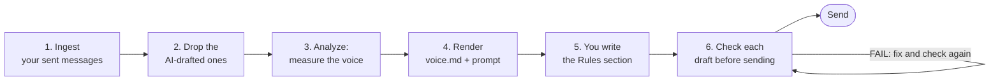

# How voiceprint works

[Back to the README](../README.md)

voiceprint learns from messages you really sent, not from a description. It first removes the messages an AI already wrote for you, so it does not learn the assistant's voice. It measures what is left and writes a voice file your AI can follow. Then `check` holds each draft to the numbers and prints what is wrong, one line per problem.

## The pipeline

1. **Ingest your sent messages.** Live Slack, a Slack workspace export, a WhatsApp chat export, JSONL or plain text:
   `python3 scripts/voiceprint.py ingest --source slack --out corpus.json`
2. **Drop the AI-drafted ones.** Point `--exclude-scan` at the folders where your old drafts live. The first nine words of each message are searched there, and a hit is dropped before anything is counted:
   `python3 scripts/voiceprint.py ingest --source slack --exclude-scan ./drafts ./docs --out corpus.json`
3. **Analyze.** It measures the corpus and warns when the recent half's median length is more than 1.6 times the older half's, because that is often AI drafts the scan missed:
   `python3 scripts/voiceprint.py analyze corpus.json --out profile.json`
4. **Render.** It writes `voice/voice.md` and `voice/voice_prompt.txt`:
   `python3 scripts/voiceprint.py render profile.json --out-dir ./voice --name "Sam"`
5. **Write the Rules section yourself.** It is left blank on purpose. A frequency table cannot see how you soften an ask or when you switch language. Read the real messages in `voice.md`, then write it, or tell your AI: "Write the Rules section of voice.md from the sampled messages."
6. **Check each draft before it goes out.** Wire it into a pre-send hook so it runs on the way out, not after:
   `python3 scripts/voiceprint.py check --profile profile.json --file draft.md`

## The four commands

| Command | What it does | Example |
| :--- | :--- | :--- |
| `ingest` | Pulls your own sent messages into a corpus, and drops the ones an AI drafted for you | `voiceprint.py ingest --source whatsapp --path ./chats --me-name "Sam" --exclude-scan ./drafts` |
| `analyze` | Measures the corpus: length, seventeen habits, sentence endings, openers, phrases | `voiceprint.py analyze corpus.json --out profile.json` |
| `render` | Writes `voice.md` for a person or an agent, and `voice_prompt.txt` to paste into a prompt | `voiceprint.py render profile.json --out-dir ./voice --name "Sam"` |
| `check` | Holds one draft against the profile. Exit 1 with a list of failures, exit 0 on a pass | `voiceprint.py check --profile profile.json --file draft.md` |

## What it measures

| What you get | Use it for |
| :--- | :--- |
| Five ways in: live Slack (a user token), a Slack export, WhatsApp chat exports, JSONL, plain text | Measuring the channel your AI drafts for, from what you already sent |
| `--exclude-scan`: messages whose first nine words appear in your drafts folders are dropped | Keeping months of AI-drafted sends out of your profile |
| Length measured as percentiles: median, 75th, 90th, and the share under 80 and 200 characters | Catching the overlong draft, which is the biggest tell |
| Seventeen habits as a share of your messages: lowercase, questions, emoji, bullets, bold, headings, tables, em-dashes and more | Flagging a habit you do not have, and noting one the draft dropped |
| Sentence-ending words ranked by lift, plus your openers and repeated phrases | Finding your softener or tic, the small word that ends your sentences far more often than chance |
| `voice.md` with the numbers and real sample messages in three length bands, and `voice_prompt.txt` | A voice file an agent reads before it drafts, and a block to paste into a prompt |
| `check`: a pre-send gate on length, rare habits, assistant filler and sign-offs, with exit codes | A hook that stops a draft that is not you, before anyone reads it |
| A drift warning that compares the older and recent halves of your messages | Spotting AI-drafted messages the scan missed, or a voice that changed |

All of it is one Python file with the standard library only. No dependencies, no install step, and nothing is sent to a model.

## Before and after

| Before | After |
| :--- | :--- |
| A three-paragraph draft when you usually write one line | A draft longer than three out of four of your messages fails `check` |
| Bullets, bold and headings in a normal chat | A habit that shows up in 2% or fewer of your messages is flagged by name |
| "Kindly", "circling back" and "Best regards" slip through | A fixed list of assistant filler and sign-offs fails before the send |
| "Write like me" in the prompt, and it is still stiff | Your AI gets your measured numbers plus real messages of yours |
